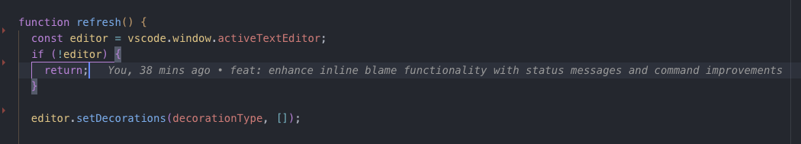

# Inline Blame Mini

A lightweight VS Code extension that shows git blame information inline for the current cursor line.



## Features

- **Performance Focused**: Only shows blame for the line where your cursor is positioned
- **Clean UI**: Displays author, time, and commit message inline with subtle styling
- **PR Support**: Prioritizes showing Pull Request titles over commit messages
- **Smart User Detection**: Shows "You" for your own commits (configurable)
- **Configurable**: Customize display options and behavior
- **Smart Updates**: Only updates when you move to a different line (not on every cursor position change)

## How it works

When you place your cursor on any line in a git-tracked file, the extension will show:

- Author name (or "You" for your commits)
- Relative time (e.g., "2 hours ago", "3 days ago")
- **PR title** (if available) or commit message summary

Example: ` You, 2 hours ago • Fix inline blame performance issue`

## PR Support

The extension intelligently detects and prioritizes Pull Request information:

- **GitHub**: `Merge pull request #123 from feature-branch` → Shows PR title
- **Bitbucket**: `Merged in feature (pull request #123)` → Shows PR title
- **GitLab**: `Feature title (!123)` → Shows merge request title
- **Generic**: `Feature: Add new functionality (#123)` → Shows feature title
- **Fallback**: Regular commit message if no PR detected

## Commands

- `Ctrl+Alt+B` (or `Cmd+Alt+B` on Mac): Toggle inline blame on/off

## Configuration

You can customize the extension in VS Code Settings:

### Basic Settings

- `inlineBlameMini.enabled`: Enable or disable the extension (default: true)
- `inlineBlameMini.maxSummary`: Maximum length of commit/PR message to display (default: 60)
- `inlineBlameMini.debounceDelay`: Delay in milliseconds before updating when cursor moves (default: 150)
- `inlineBlameMini.showCurrentUserAsYou`: Show 'You' instead of your name for your commits (default: true)

### Style Settings

Choose between predefined presets or customize individual properties:

- `inlineBlameMini.style.preset`: Apply a predefined style preset:
  - `custom` - Use individual style settings (default)
  - `subtle` - Low opacity, smaller font, italic
  - `prominent` - Bold, higher opacity, larger margin
  - `minimal` - Very subtle, small font, minimal spacing
  - `modern` - Clean modern look with custom colors

### Custom Style Properties (when preset is 'custom')

- `inlineBlameMini.style.color`: Color of the text (theme color ID or CSS color like '#888888')
- `inlineBlameMini.style.fontStyle`: Font style (`normal`, `italic`, `oblique`)
- `inlineBlameMini.style.fontWeight`: Font weight (`normal`, `bold`, `100`-`900`)
- `inlineBlameMini.style.fontSize`: Font size (e.g., '12px', '0.9em')
- `inlineBlameMini.style.opacity`: Opacity from 0.1 to 1.0
- `inlineBlameMini.style.margin`: CSS margin (e.g., '0 0 0 1rem')
- `inlineBlameMini.style.textDecoration`: Text decoration (`none`, `underline`, `line-through`)

### Style Examples

```json
// Subtle and minimal
"inlineBlameMini.style.preset": "subtle"

// Custom red italic text
"inlineBlameMini.style.preset": "custom",
"inlineBlameMini.style.color": "#ff6b6b",
"inlineBlameMini.style.fontStyle": "italic",
"inlineBlameMini.style.opacity": 0.8

// Use VS Code theme colors
"inlineBlameMini.style.color": "editorWarning.foreground"
```

## Requirements

- Git must be installed and available in your PATH
- File must be saved and part of a git repository

## Performance Notes

This extension is designed to be lightweight and performant:

- Only queries git blame for the current line (not the entire file)
- Intelligent PR detection using commit message patterns
- Uses debouncing to prevent excessive git calls
- Caches user information to avoid repeated git config calls
- Clears decorations when switching between files
- Only updates when moving to a different line number

## Known Limitations

- Requires saved files (doesn't work with unsaved/dirty files)
- Only works within git repositories
- Requires git to be accessible from the command line
- PR detection depends on conventional commit message formats

## Development

To package and install:

```bash
bun install
bun run lint
bun run format
bun run package
code --install-extension inline-blame-mini-*.vsix
```
