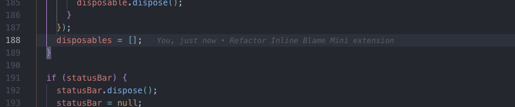

# Inline Blame Mini

A minimal VS Code extension that shows git blame information inline for the current cursor line.

## Screenshots

### Inline Blame Display

### Status Bar Information

## Features

- **Lightweight**: Only shows blame for the line where your cursor is positioned
- **Clean**: Displays author, time, and commit message inline with subtle styling
- **Smart**: Shows "You" for your own commits and detects Pull Request information
- **Fast**: Optimized with debouncing and caching for better performance

## How it works

When you place your cursor on any line in a git-tracked file, the extension automatically shows:

- **Inline blame text** (see first screenshot above): Author name (or "You" for your commits), relative time, and commit message
- **Status bar information** (see second screenshot above): Simplified format with author and time
- Pull Request title detection when available
- Automatic updates when moving between lines

Example inline format: ` You, 2 hours ago • Fix inline blame performance issue`

The extension works automatically - no commands or configuration needed!

## Requirements

- Git must be installed and available in your PATH
- File must be saved and part of a git repository

## Error Handling & Troubleshooting

The extension provides comprehensive error handling with helpful feedback:

### Status Bar Messages

- **Git not available**: Git is not installed or not in PATH
- **Not a git repository**: File is not in a git repository
- **File not tracked**: File exists but is not tracked by git
- **Operation timed out**: Git operation took too long (large repos)
- **Unsaved changes**: File has modifications affecting blame accuracy

### Interactive Help

When errors occur, you can:

- Click on error/warning status bar items to get help
- Use **Command Palette** → `Inline Blame Mini: Show Troubleshooting Guide`
- Get step-by-step solutions for common issues

### Common Solutions

- **Git not found**: Install Git from [git-scm.com](https://git-scm.com/downloads)
- **Not a git repo**: Run `git init` in your project folder
- **File not tracked**: Run `git add filename.ext` to track the file
- **Timeout issues**: Check repository size and network connection

## Performance

This extension is designed to be extremely fast and efficient:

### Intelligent Caching

- **Blame Cache**: Results cached per file/line/document version
- **Repository Cache**: Git repository detection cached per file
- **Commit Cache**: Git commit messages cached to avoid repeated lookups
- **PR Cache**: Pull request information cached for faster detection
- **User Cache**: Git user information cached per workspace

### Smart Processing

- **Duplicate Detection**: Avoids processing same file/line combinations
- **Change Detection**: Only refreshes when cursor moves to different lines
- **Selective Updates**: Document changes only trigger refresh if they affect current line
- **Debounced Operations**: Prevents excessive git calls during rapid changes

### Optimized Git Operations

- **Single Line Blame**: Only queries git blame for current line (not entire files)
- **Timeout Protection**: All git operations have timeouts to prevent hanging
- **Process Management**: Proper cleanup of git processes
- **Minimal Parsing**: Efficient parsing of git blame output

### Memory Management

- **Cache Limits**: Automatic cleanup when caches exceed size limits
- **Workspace Cleanup**: Caches cleared on workspace/configuration changes
- **Resource Disposal**: Proper cleanup of event listeners and decorations

### Timing Optimizations

- **Fast Debouncing**: 100ms for cursor movement (down from 150ms)
- **Quick Saves**: 50ms debounce for file saves (down from 200ms)
- **Smart Document Changes**: 300ms debounce only for relevant changes
- **Reduced Timeouts**: Faster git operation timeouts for responsiveness

## Styling

The extension uses these default styles (configurable via constants in code):

- Color: `rgba(136, 136, 136, 0.7)` (gray with opacity)
- Font: Italic, 0.9em size
- Margin: 1rem left padding
