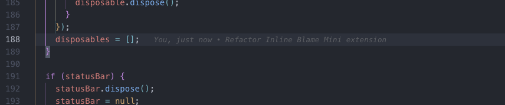

# Inline Blame Mini

[](https://marketplace.visualstudio.com/items?itemName=JoaoPauloCMarra.inline-blame-mini)
[](https://open-vsx.org/extension/JoaoPauloCMarra/inline-blame-mini)
[](https://www.cursor.com/)
[](https://code.visualstudio.com/)
[](LICENSE.md)

Lightweight inline Git blame for VS Code and Cursor. It shows the author, relative time, and commit summary for the line under your cursor without opening a separate blame view.



## Features

- Inline blame for the active cursor line
- End-of-line, above-line, or below-line display modes
- Status bar summary for the active file
- Commit detail panel from the command palette
- Configurable text format, color, font style, font size, margin, and file filters
- Batched Git blame, bounded caches, async file checks, and stale-result guards
- Nested Git repository support inside larger VS Code workspaces

## Install

- **VS Code:** install from the [Visual Studio Marketplace](https://marketplace.visualstudio.com/items?itemName=JoaoPauloCMarra.inline-blame-mini).
- **Cursor:** search for `Inline Blame Mini` in the Extensions panel. Cursor distributes third-party extensions through [Open VSX](https://open-vsx.org/extension/JoaoPauloCMarra/inline-blame-mini).

You can also build a local VSIX:

```sh
bun ci
bun run package
```

Then install the generated `.vsix` from VS Code or Cursor with `Extensions: Install from VSIX...`.

## Requirements

- VS Code `1.96.0` or newer, or a compatible Cursor release
- Git available on `PATH`
- A saved file tracked by Git

Untitled files, ignored files, untracked files, empty lines, very large files, and files outside a Git repository are skipped.

## Usage

1. Open a Git-tracked file.
2. Move the cursor to a non-empty line.
3. Inline blame appears using the configured format.

The default format is:

```text
{author}, {timeAgo} • {summary}
```

Available format tokens:

- `{author}`
- `{timeAgo}`
- `{summary}`
- `{hash}`

## Commands

| Command                                         | Description                                      |
| ----------------------------------------------- | ------------------------------------------------ |
| `Inline Blame Mini: Toggle Inline Blame`        | Enable or disable inline blame                   |
| `Inline Blame Mini: Refresh Blame Information`  | Refresh blame for the active line                |
| `Inline Blame Mini: Show Commit Details`        | Open the commit detail panel for the active line |
| `Inline Blame Mini: Show Troubleshooting Guide` | Open troubleshooting help                        |
| `Inline Blame Mini: Open Settings`              | Open extension settings                          |

## Configuration

```json
{
  "inline-blame-mini.enabled": true,
  "inline-blame-mini.format": "{author}, {timeAgo} • {summary}",
  "inline-blame-mini.summaryMaxLength": 60,
  "inline-blame-mini.style.position": "end-of-line",
  "inline-blame-mini.style.color": "rgba(136, 136, 136, 0.7)",
  "inline-blame-mini.statusBar.enabled": true,
  "inline-blame-mini.includeFiles": ["**/*"],
  "inline-blame-mini.excludeFiles": []
}
```

Display positions:

- `end-of-line`
- `above-line`
- `below-line`

## Troubleshooting

| Symptom                 | Check                                                                  |
| ----------------------- | ---------------------------------------------------------------------- |
| No blame appears        | Confirm the file is saved, Git-tracked, and inside a repository        |
| Git error in status bar | Confirm `git --version` works in your terminal                         |
| File is skipped         | Check `includeFiles`, `excludeFiles`, file size, and line count        |
| Blame looks stale       | Save the file, then run `Inline Blame Mini: Refresh Blame Information` |

You can also run `Inline Blame Mini: Show Troubleshooting Guide` from the command palette.

## Development

```sh
bun ci
bun run test
bun run lint
bun run format:check
bun run test:extension
bun run test:extension:latest
bun run verify:cursor-install
bun run release:check
```

The default extension smoke test runs against the minimum supported VS Code version. `test:extension:latest` checks the current stable release, and `verify:cursor-install` installs the packaged VSIX through an isolated Cursor profile. The generated `.vscode-test` directory is ignored by linting and packaging.

## Packaging

`bun run release:check` runs tests, lint, formatting checks, packages the VSIX, and installs it through temporary VS Code and Cursor profiles. After publishing, run `bun run verify:marketplace-install` before announcing the release. The packaged extension includes only runtime files:

- `LICENSE.md`
- `CHANGELOG.md`
- `icon.png`
- `package.json`
- `README.md`
- `src/**`

## License

[MIT](LICENSE.md)
